# Phase 2 Project


## Project Overview

This project analyzes house sales data in a northwestern county using regression model.


## Business Problem

After buiding the regression model, the features that are closely related to house price will be identified. 

Therefore, some suggestions could be given to both the buyers and sellers.

* For the buyer, they will know the price of the house based on the characteristics of the house, and also, what's the investment value for the house.

* For the seller, they may know whether they can do something to sell the house with a better price.


## Data

This project uses the King County House Sales dataset, which can be found in  `kc_house_data.csv` in the data folder in this repo. 
The description of the column names can be found in `column_names.md` in the same folder.


## Methods
### Importing necessary libraries
```python
# Warning off
import warnings
warnings.filterwarnings('ignore')

# import pandas and numpy
import pandas as pd
import numpy as np

# import data visualization
import matplotlib.pyplot as plt
import seaborn as sns
sns.set_style('darkgrid')
%matplotlib inline

# import linear regression related modules
from statsmodels.formula.api import ols
from statsmodels.stats.outliers_influence import variance_inflation_factor
import statsmodels.api as sm
import scipy.stats as stats
from sklearn.linear_model import LinearRegression
from sklearn.model_selection import train_test_split
```


###  Loading data to check the potential features
```python
#loading kc_house_data.csv data
df = pd.read_csv('./data/kc_house_data.csv')
df.head() # checking the head for information
```

```python
# Describe the dataset using 5-point statistics
df.describe()
# What data is available to us?
df.info()
```
#We have potentially 19 predictors excluding the id and the target,i.e.,the price
#We have a total of 21597 rows, while some rows have null values in some predictors
#Several predictors' data type need to be changed

### Data Preparation
#### Deal with data types: sqft_basement & date
```python
#sqft_basement: Numerical Data Stored as Strings need to be reformat to float
print(df.sqft_basement.unique())
df.sqft_basement.value_counts()
#there is '?' in the sqft_basement, need to be replaced as nan before reformat to float
df.sqft_basement = df.sqft_basement.map(lambda x: float(x.replace('?', 'nan')))
df.sqft_basement.unique()
```

```python
# For the sold date, since day is not important for the regression model,
# I only extract year and month for the sold date, and add two columns as year_sold and month_sold
df['year_sold'] = pd.DatetimeIndex(df['date']).year
df['month_sold'] = pd.DatetimeIndex(df['date']).month

# Based on the yr_built and month_sold, I create another column as age_sold of the house
df['age_sold'] = df['year_sold'] - df['yr_built'] + 1
df.head()
```

#### Deal with null values
```python
# Get the percentage value of null data for each column
df.isnull().sum()*100/df.shape[0]
```

```python
# There are some null data in waterfront, view, yr_renovated, sqft_basement
# 1) since the percentage of null data in view is low, I just drop these rows
# 2) For waterfront and yr_renovated, the percentage of null data is high,I will assign another value there

# waterfront is a categorical variable
df.waterfront.value_counts()
# replace nan as a value: 
# Originally I used 2.0 as a third category, 
# but late I found the price for this missing data is similar as for waterfront == 0
# Therefore, I fill the null as 0
df.waterfront = df.waterfront.fillna(0)
df.waterfront.value_counts()

# yr_renovated has 17011/17755~96% without renovation, 
#  and only 4% with renovation based on the non-null data
df.yr_renovated.value_counts()
# take a look of histogram
fig, axs = plt.subplots(2,figsize=(12,8))
df['yr_renovated'].hist(ax = axs[0]);
axs[0].set_title('All non-null data')
axs[0].set_xlabel('Year')
# with renovation
df[df.yr_renovated > 0].yr_renovated.hist(ax = axs[1])
# dfwrenov['yr_renovated'].hist(ax = axs[1]);
axs[1].set_title('Renovation data')
axs[0].set_xlabel('Year')
# Based on renovated data, I create a caterogrial variable as is_renovated

ds_renovated = df['yr_renovated']
ds_renovated[ds_renovated >0] = 1
# replace nan as a value: 
# Originally I used 2.0 as a third category, 
# but late I found the price for this missing data is similar as for is_renovated == 0
# Therefore, I fill the null as 0
ds_renovated = ds_renovated.fillna(0)
ds_renovated
df['is_renovated'] = ds_renovated
del ds_renovated
df.is_renovated.value_counts()
# assign as -1 to make sure these rows are not dropped in the following operation
df.yr_renovated = df.yr_renovated.fillna(-1)
# for view and sqft_basement, I just drop those rows with null value, since they are only a few
df.dropna(inplace=True)
print(df.info())
print(df.shape)
df.is_renovated.value_counts()
```


#### Deal with outliers if existed in some columns
```python
# For some selected columns, have a boxplot to examine the outliers
x_cols = ['price','bedrooms','bathrooms','sqft_living','sqft_lot',
          'floors','sqft_above','sqft_basement','sqft_living15','sqft_lot15']
fig, axs = plt.subplots(2,5, figsize = (15,6))
for colii in range(len(x_cols)):
    sns.boxplot(df[x_cols[colii]],ax = axs[colii//5, colii%5])
plt.tight_layout()
```
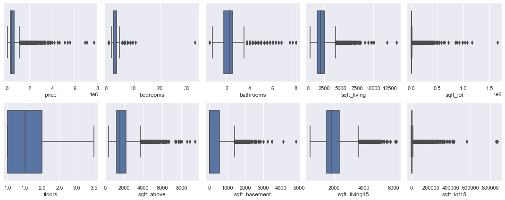

```python
# process of outliers:
# It seems all these items except floors have outliers
# I will drop the outliers as there are sufficient data

x_cols = ['price','bedrooms','bathrooms','sqft_living','sqft_lot',
          'sqft_above','sqft_basement','sqft_living15','sqft_lot15']

for colname in x_cols:
    Q1 = df[colname].quantile(0.25)
    Q3 = df[colname].quantile(0.75)
    IQR = Q3 - Q1
    lenori = len(df[colname])
    df = df[(df[colname] >= Q1 - 1.5*IQR) & (df[colname] <= Q3 + 1.5*IQR)]
    lennew = len(df[colname])
    print(f'Number of rows based on {colname} : {lenori} -> {lennew}')
```
Number of rows based on price : 21082 -> 19951
Number of rows based on bedrooms : 19951 -> 19502
Number of rows based on bathrooms : 19502 -> 19437
Number of rows based on sqft_living : 19437 -> 19181
Number of rows based on sqft_lot : 19181 -> 17163
Number of rows based on sqft_above : 17163 -> 16697
Number of rows based on sqft_basement : 16697 -> 16401
Number of rows based on sqft_living15 : 16401 -> 16195
Number of rows based on sqft_lot15 : 16195 -> 15831

```python
# boxplot for the remaining data
fig, axs = plt.subplots(2,5, figsize = (15,6))
for colii in range(len(x_cols)):
    sns.boxplot(df[x_cols[colii]],ax = axs[colii//5, colii%5])
plt.tight_layout()
# now looks all good
```
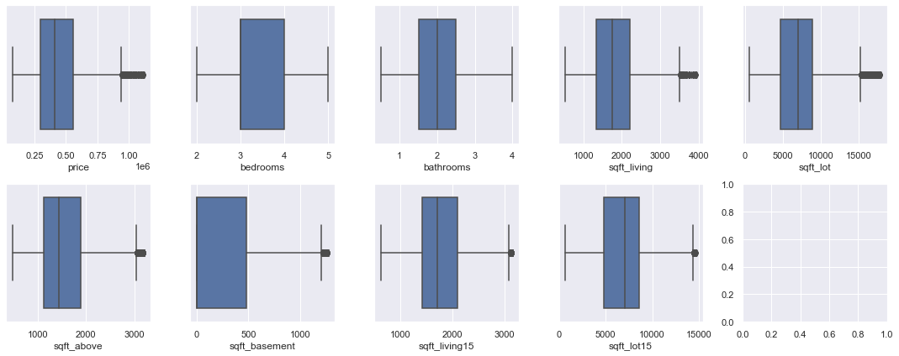

```python
# visualization of the final data
# with its histogram:
df.hist(figsize = (20,18));
print(df.waterfront.value_counts())
print(df.condition.value_counts())
print(df.is_renovated.value_counts())
# looks good
df.bathrooms.value_counts()
```
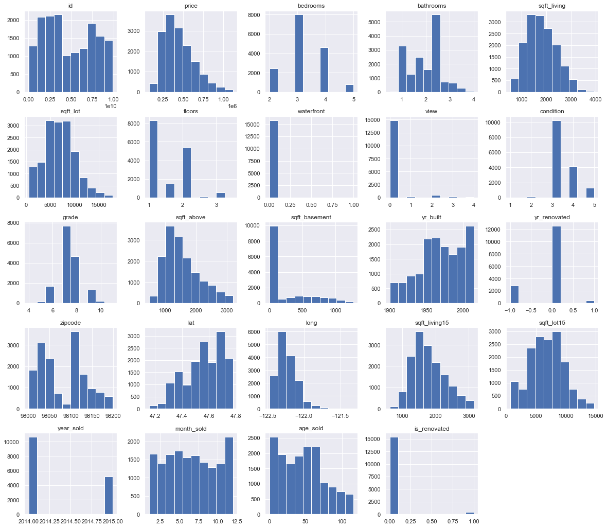

#### Deal with zipcode
```python
# df.zipcode.value_counts()
# I only keep the first four digits since if I only keep the first three digits,it will only have two zipcodes
df['zipcode4'] = df.zipcode//10 * 10
df.zipcode4.value_counts()
```
98110    2051
98050    1831
98030    1767
98100    1594
98000    1488
98020    1243
98120     931
98130     689
98040     629
98140     588
98070     524
98190     465
98170     407
98160     369
98150     366
98010     337
98090     229
98060     209
98180     114
Name: zipcode4, dtype: int64

```python
# visualization of categorical variables 
cat_vars = ['bedrooms','bathrooms','floors','waterfront','is_renovated','condition','view','grade','zipcode4']
plt.figure(figsize=(20, 12))
for idx in range(len(cat_vars)):
    plt.subplot(3,3,idx+1)
    sns.boxplot(x = cat_vars[idx], y = 'price', data = df)
```
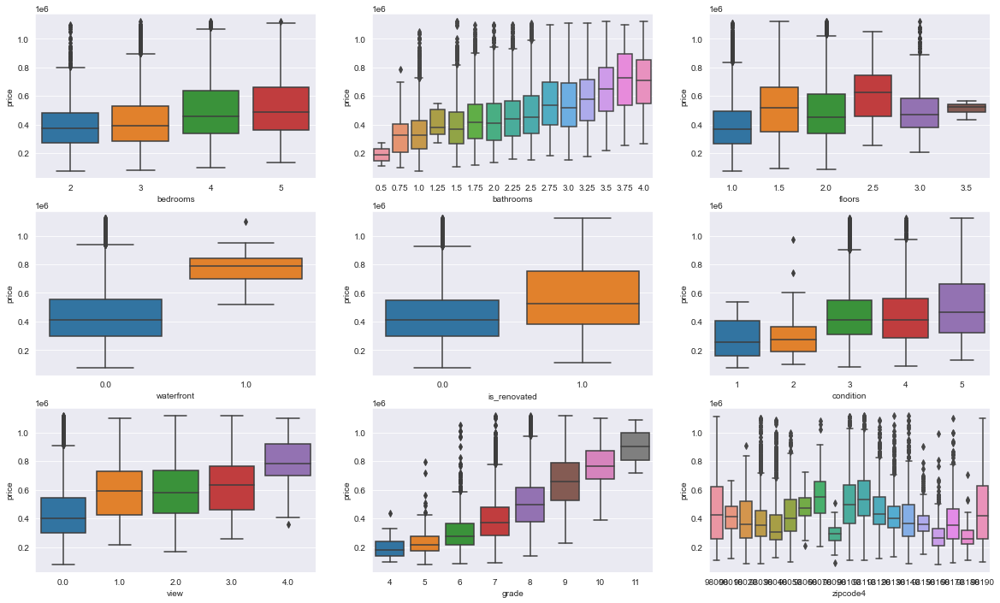

```python
# For the zip codes, I implemented the one hot encoding .get_dummies() method
zipcode4_dums = pd.get_dummies(df['zipcode4'])
df = pd.concat([df,zipcode4_dums],axis = 1)
df.head()
```

```python
# drop one zipcode to redact redundant information, I will drop 98110, since it has the most numeber of 1
df.drop([98110], axis = 1, inplace = True)
df.head()
```

### Modeling
After finishing the data preparation, now I start to build the regression model

```python
# drop id, date, yr_renovated,lat, long, zipcode from df
# the id has not related to the house price
# the date has been transformed into sold_year and sold_month
# the yr_renovated has been transformed into is_renovated
# the lat and long indicate similar information as zipcode
# zipcode has been transformed into zipcode4 and dummy variables
# I keep zipcode4 try to take a look which one is better based on either zipcode4 or zipcode_dummies
drop_vars = ['id','date','yr_renovated','lat','long','zipcode']
df.drop(drop_vars, axis = 1, inplace = True)
df.head()
```
```python
# transform column names as string
df.columns = df.columns.astype(str)
df.head()
```

```python
# Rescaling the features except the 'dummy' variable
from sklearn.preprocessing import MinMaxScaler
scaler = MinMaxScaler()
num_vars = list(['bedrooms', 'bathrooms', 'sqft_living',
       'sqft_lot', 'floors', 'waterfront', 'view', 'condition', 'grade',
       'sqft_above', 'sqft_basement', 'yr_built', 'is_renovated',
       'sqft_living15', 'sqft_lot15', 'year_sold','age_sold',
       'month_sold'])
df_scl = df
df_scl[num_vars] = scaler.fit_transform(df[num_vars])
df_scl.head()
```

```python
#Check the distribution of the target: price, to see whether it follows a normal distribution 
sns.distplot(df_scl['price'] , fit=stats.norm);

# Get the fitted parameters used by the function
(mu, sigma) = stats.norm.fit(df_scl['price'])
print( '\n mean = {:.2f} and std dev = {:.2f}\n'.format(mu, sigma))

#NPlotting the distribution
plt.legend(['Normal dist. ($\mu=$ {:.2f} and $\sigma=$ {:.2f} )'.format(mu, sigma)],
            loc='best')
plt.ylabel('Frequency')
plt.title('Distribution of Price')

#Also the QQ plot
fig = plt.figure()
res = stats.probplot(df_scl['price'], plot=plt)
plt.show()
```
mean = 446934.39 and std dev = 188664.37

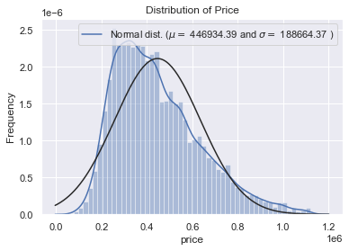
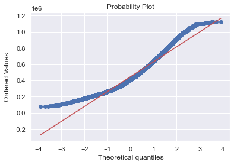

```python
# it looks the target is skewed right, therefore, I used a log transformation to make it more normal
#Using the log1p function applies log(1+x) to all elements of the column
df_scl['price_log1p'] = np.log1p(df_scl['price'])

#Check the new distribution after log transformation 
sns.distplot(df_scl['price_log1p'] , fit=stats.norm);

# Get the fitted parameters used by the function
(mu, sigma) = stats.norm.fit(df_scl['price_log1p'])
print( '\n mean = {:.2f} and std dev = {:.2f}\n'.format(mu, sigma))

#NPlotting the distribution
plt.legend(['Normal dist. ($\mu=$ {:.2f} and $\sigma=$ {:.2f} )'.format(mu, sigma)],
            loc='best')
plt.ylabel('Frequency')
plt.title('Distribution of Log(1+price)')

#Also the QQ plot
fig = plt.figure()
res = stats.probplot(df_scl['price_log1p'], plot=plt)
plt.show()
```
mean = 446934.39 and std dev = 188664.37

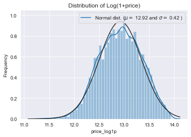
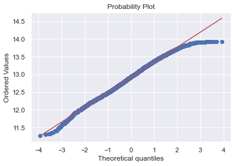

```python
# Splitting the Data into Training and Testing
df_train, df_test = train_test_split(df, train_size = 0.8, test_size = 0.2, random_state = 100)
print(len(df_train), len(df_test))
df_train.head()
df.columns
```


Checking for Multicollinearity
```python
# Check the correlation coefficients to see which variables are highly correlated
num_vars.append('price')
num_vars.append('price_log1p')
corr = df_train[num_vars].corr()
corr
# Using heatmap to visualzation of the correlation coefficients
sns.set(rc = {'figure.figsize':(18,10)})
sns.heatmap(corr, center=0, annot=True);
```
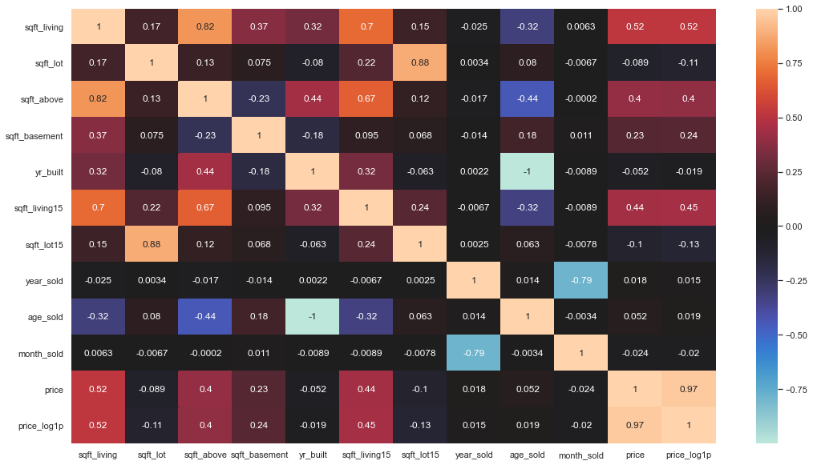
Price seems to be correlated to sqrt_living and grade the most. 
And some sqft-related and rooms-related variables have high correlation, e.g., sqft_living vs.bedrooms and bathrooms

```
# Fitting the actual model with all available features, zipcode with dummy values
import statsmodels.api as sm

# price vs price_log1p
outcome1 = 'price'
outcome2 = 'price_log1p'
x_cols = list(df_train.columns)
x_cols.remove(outcome1)
x_cols.remove(outcome2)
x_cols.remove('zipcode4')
model1 = sm.OLS(df_train[outcome1],sm.add_constant(df_train[x_cols])).fit()
print(model1.summary())
model2 = sm.OLS(df_train[outcome2],sm.add_constant(df_train[x_cols])).fit()
print(model2.summary())

# zipcode_dummy vs zipcode4
outcome1 = 'price'
outcome2 = 'price_log1p'
# x_cols = list(df.columns)
# x_cols.remove(outcome1)
# x_cols.remove(outcome2)
# # remove zipcdoe_dummies
# for colname in x_cols:
#     if colname.startswith('98') == 1:
#         x_cols.remove(colname)
# print(x_cols)
x_cols = ['bedrooms', 'bathrooms', 'sqft_living', 'sqft_lot', 'floors', 
          'waterfront', 'view', 'condition', 'grade', 'sqft_above', 
          'sqft_basement', 'yr_built', 'sqft_living15', 'sqft_lot15',
          'year_sold', 'month_sold', 'age_sold', 'is_renovated', 'zipcode4']
model3 = sm.OLS(df_train[outcome1],sm.add_constant(df_train[x_cols])).fit()
print(model3.summary())
model4 = sm.OLS(df_train[outcome2],sm.add_constant(df_train[x_cols])).fit()
print(model4.summary())
```


# Based on the R-squared values from four models, 
# I choose to use outcome = 'price_log1p' and zipcode_dummies for regression model
# price_log1p
outcome = 'price_log1p'
x_cols = list(df_train.columns)
x_cols.remove(outcome)
x_cols.remove('price')
model0 = sm.OLS(df_train[outcome],sm.add_constant(df_train[x_cols])).fit()
print(model0.summary()) 
```
 

``` python
# Remove the insignificant Features and rerun the model
summary = model0.summary()
p_table = summary.tables[1]
p_table = pd.DataFrame(p_table.data)
p_table.columns = p_table.iloc[0]
p_table = p_table.drop(0)
p_table = p_table.set_index(p_table.columns[0])
p_table['P>|t|'] = p_table['P>|t|'].astype(float)
x_cols = list(p_table[p_table['P>|t|'] < 0.05].index)
x_cols.remove('const')
print(len(p_table), len(x_cols))

p_table.head()
x_cols
```


``` python
model1 = sm.OLS(df_train[outcome],sm.add_constant(df_train[x_cols])).fit()
model1.summary()
```


```python
#Investigate the multicollinearity
X = df_train[x_cols]
vif = [variance_inflation_factor(X.values, i) for i in range(X.shape[1])]
list(zip(x_cols, vif))
```
 
```python
# remove the features with vif >=5
vif_scores = list(zip(x_cols, vif))
x_cols = [x for x,vif in vif_scores if vif < 5]
print(len(vif_scores), len(x_cols))
x_cols
```
 
```python
# Refit model with subset features
model2 = sm.OLS(df_train[outcome],sm.add_constant(df_train[x_cols])).fit()
model2.summary()
```


```python
# checking normality
fig = sm.graphics.qqplot(model2.resid, dist=stats.norm, line='45', fit=True)
```
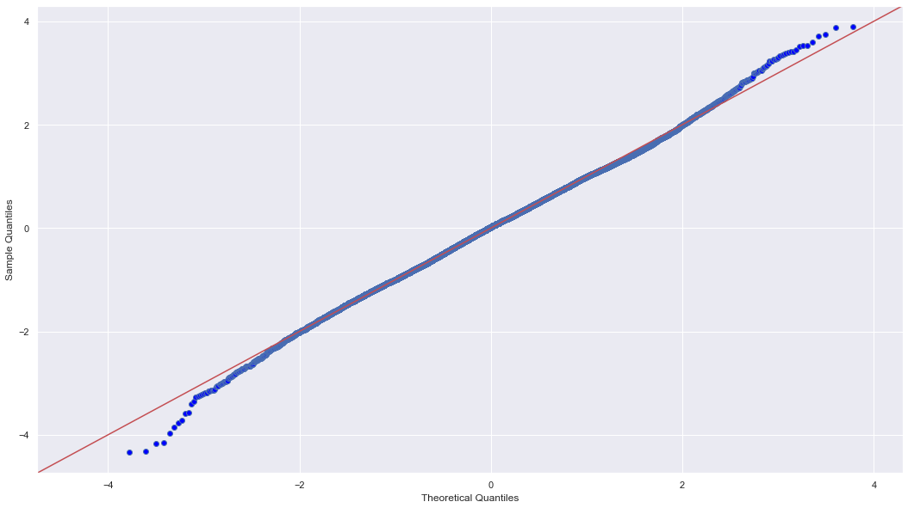

```python
#Check Homoscedasticity Assumption
plt.figure(figsize = (8,6))
plt.scatter(model2.predict(sm.add_constant(df_train[x_cols])), model2.resid)
plt.plot(model2.predict(sm.add_constant(df_train[x_cols])), [0 for i in range(len(df_train[x_cols]))]
```
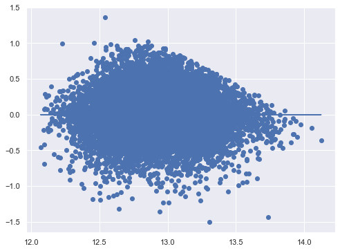

model2 seems pretty good in terms of normality, Homoscedasticity, and R-squared values

### Evaluation
```python
from sklearn.linear_model import LinearRegression

final_model = LinearRegression()
# Fit the model on X_train_final and y_train
final_model.fit(df_train[x_cols], df_train[outcome])

# Score the model on X_test_final and y_test
# (use the built-in .score method)
print( "Test score:  ", final_model.score(df_test[x_cols], df_test[outcome]))
print( "Train score: ", final_model.score(df_train[x_cols], df_train[outcome]))
```
Test score:   0.44378007421545485
Train score:  0.44859642929281374

```python
# use cross validation to evaluate the model
from sklearn.model_selection import cross_validate, ShuffleSplit
splitter = ShuffleSplit(n_splits=3, test_size=0.25, random_state=0)
baseline_scores = cross_validate(
    estimator = final_model,
    X= df[x_cols],
    y= df[outcome],
    return_train_score=True,
    cv=splitter
)
print("Train score:     ", baseline_scores["train_score"].mean())
print("Validation score:", baseline_scores["test_score"].mean())
```
```python
Train score:      0.44648159473484395
Validation score: 0.4500640604866031
```
Train and validation scores are similar

```python
# check mean squared error, root mean squared error, and Mean absolute error
from sklearn.metrics import mean_squared_error
from sklearn.metrics import mean_absolute_error
from sklearn.metrics import r2_score
import math
print("MSE:       ", mean_squared_error(df_test[outcome], final_model.predict(df_test[x_cols])))
print("RMSE:      ", math.sqrt(mean_squared_error(df_test[outcome], final_model.predict(df_test[x_cols]))))
print("MAE:       ", mean_absolute_error(df_test[outcome], final_model.predict(df_test[x_cols])))
print("R-Squared: ", r2_score(df_test[outcome], final_model.predict(df_test[x_cols])))            
```
MSE:        0.10077497430795615
RMSE:       0.3174507431208126
MAE:        0.251980604965677
R-Squared:  0.44378007421545485

```python
# visualization of real and predicted values for each value
preds = final_model.predict(df_test[x_cols])
fig, axs = plt.subplots(1,2, figsize =(16,8))
perfect_line = np.arange(min(preds.min(),df_test[outcome].min())*0.99, max(preds.max(),df_test[outcome].max())*1.01)
axs[0].plot(perfect_line,perfect_line, linestyle="--", color="black", label="Perfect Fit")
axs[0].scatter(df_test[outcome], preds, alpha=0.5)
axs[0].set_xlabel("Actual Price")
axs[0].set_ylabel("Predicted Price")
axs[0].legend();
axs[0].set_xlim([min(preds.min(),df_test[outcome].min())*0.99, max(preds.max(),df_test[outcome].max())*1.01])
axs[0].set_ylim([min(preds.min(),df_test[outcome].min())*0.99, max(preds.max(),df_test[outcome].max())*1.01])
axs[1].scatter(df_test[outcome], np.divide((df_test[outcome] - preds),df_test[outcome]) * 100, alpha=0.5)
axs[1].set_xlabel("Actual Price")
axs[1].set_ylabel("(Predicted Price - actual price)/actual price * 100")
```
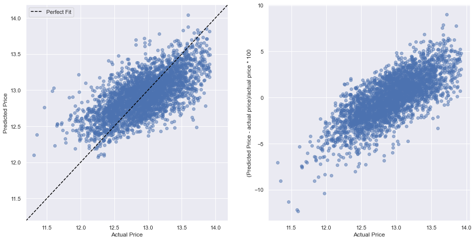

From above values and plots, the fitted regression model can predict house price very well

## Summary
```python
# the beta coefficients for different predictors
print(pd.Series(final_model.coef_, index=x_cols, name="Coefficients"))
print()
print("Intercept:", final_model.intercept_)
```


### From coefficients described above, I observed:
1) The grade and sqft_living15 have the strongest relationship with the house price¶
2) It is interesting to see the sqft_lot15 has the negative relationship with the house price
3) Waterfront_1.0 and grade_11 also have postive relationship with the price
4) For some zipcode, e.g., 98100 and 98110, they have high positive relationship with the price
### To address the business question:
1) For buyer, they will know the house price is higer for a house with high grade and sqrt_living15
2) For seller, if they want to sell their house with a higher price, they could add waterfront, improve the grade/condition.
